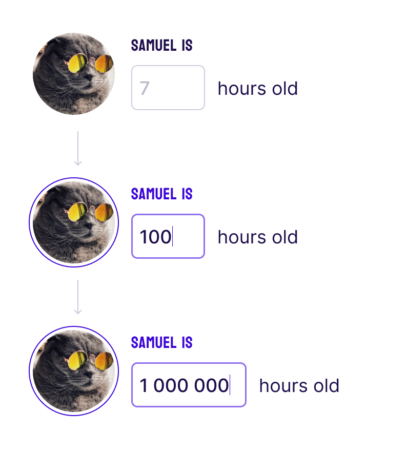

Goal
## Create a numeric input component.



[Figma](https://www.figma.com/file/OcyCt22I1Ha3fgLzGi0ZZy/Front-end-UI-Task?type=design&node-id=1-4&mode=design&t=ZzZ3vo84xwZ6uxJF-0)

### Functional requirements:
1. The user should only be able to enter digits.
2. Groups of 3 digits should be separated by spaces (“1442” → “1 442”).
3. Starting at a width of 72 px, the input should adapt to the size of the entered value.

### Design requirements:
1. Should match the provided [Figma](https://www.figma.com/file/OcyCt22I1Ha3fgLzGi0ZZy/Front-end-UI-Task?type=design&node-id=1-4&mode=design&t=ZzZ3vo84xwZ6uxJF-0).

### Code requirements:
1. The input component should be usable as-is in other parts of the project.
2. You can modify this project as you see fit to match a “production-ready” state. (optional)
3. You can use any library/component that you deem necessary and would use in a real application. (optional)

---

## Getting started

```bash
npm install
npm run dev      # http://localhost:5173/front-task-react/
npm test         # vitest
npm run lint
npm run typecheck
npm run build    # → docs/ (GH Pages source)
```

## Live preview

[alex-mextner.github.io/front-task-react](https://alex-mextner.github.io/front-task-react/)

## Where things live

- `src/components/NumericInput/` — the input component + unit tests.
- `src/components/FieldLabel.tsx` — shared label styled per Figma (Koulen 16/15/0.02em).
- `src/views/` — `PeopleList`, `PersonEdit`, `Settings`.
- `src/views/peopleFilter.ts` — `isVisibleByAge` pure helper + edge-case tests.
- `src/store/index.ts` — Zustand store.
- `src/assets/base.css` — Tailwind v4 imports and Figma design tokens (`@theme`).
- `docs/` — built site published via GitHub Pages.
